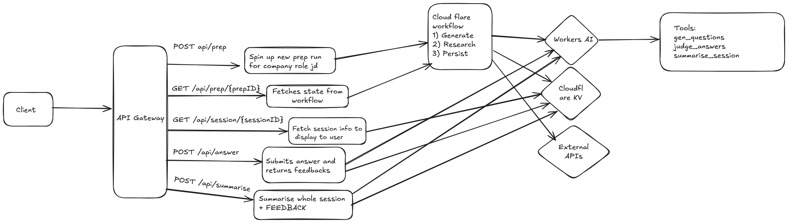

# cf_ai_interviewprep

AI-powered interview preparation tool built on Cloudflare Workers, Workers AI, and KV storage.

## What it does

Researches companies, generates tailored interview questions, evaluates answers with AI feedback, and stores session history. The entire stack runs on Cloudflare infrastructure.

## Basic Architecture 



## Tech Stack

**Backend:**
- Cloudflare Workers (Hono framework)
- Workers AI (Llama 3.1 8B Instruct)
- Cloudflare KV

**Frontend:**
- Next.js 15 with TypeScript
- Tailwind CSS + shadcn/ui
- Cloudflare Pages ready

## Running Locally

### Backend

```bash
cd backend
npm install
npx wrangler login
npx wrangler kv:namespace create SESSIONS
# Add the namespace ID to wrangler.toml
npm run dev
# Runs on http://localhost:8787
```

### Frontend

```bash
cd frontend
npm install
echo "NEXT_PUBLIC_BACKEND_URL=http://localhost:8787" > .env.local
npm run dev
# Runs on http://localhost:3000
```

Navigate to http://localhost:3000/start to begin.

## Deployment

### Worker
```bash
cd backend
npx wrangler deploy
```

### Frontend
```bash
cd frontend
npm run build
npx wrangler pages deploy out
```

Update `NEXT_PUBLIC_BACKEND_URL` in production to your deployed Worker URL.

## How it works

1. User enters company name and role
2. System fetches company data from Wikipedia and company websites via Jina AI Reader
3. Workers AI processes the data to extract structured company profile (values, culture, tech stack)
4. AI generates 5 personalized questions (3 behavioral, 2 technical) based on the company profile
5. User answers questions one by one
6. Each answer is evaluated by AI with rating and detailed feedback
7. Session data persists in KV
8. Results page shows overall performance with question-by-question breakdown

## API Endpoints

| Method | Path | Description |
|--------|------|-------------|
| POST | `/api/prep` | Create interview session, returns sessionId |
| GET | `/api/session/:sessionId` | Get session with questions and answers |
| POST | `/api/answer` | Submit answer, returns AI evaluation |
| POST | `/api/summarise` | Generate overall session feedback |
| POST | `/api/research` | Research company profile only |
| POST | `/api/questions` | Generate questions only |

## Project Structure

```
cf_ai_interviewprep/
├── backend/
│   ├── src/
│   │   ├── index.ts              # API routes
│   │   ├── session.ts            # KV operations
│   │   └── llm/
│   │       ├── company_research.ts
│   │       └── generate_questions.ts
│   └── wrangler.toml
├── frontend/
│   ├── src/
│   │   ├── app/
│   │   │   ├── start/            # Form page
│   │   │   ├── interview/        # Interview and results pages
│   │   │   └── api/              # Proxy routes to backend
│   │   ├── components/
│   │   │   ├── interview/        # QuestionCard, AnswerInput, EvaluationCard
│   │   │   └── ui/               # shadcn components
│   │   ├── hooks/
│   │   │   ├── useInterview.ts
│   │   │   └── useInterviewForm.ts
│   │   └── types/
│   └── package.json
├── PROMPTS.MD                    # All AI prompts used
└── README.md
```

## AI Model

Uses `@cf/meta/llama-3.1-8b-instruct` for all prompts. Total token usage per session is approximately 5,000-7,000 tokens across 7 API calls (1 research, 1 question generation, 5 answer evaluations).

See [PROMPTS.MD](./PROMPTS.MD) for complete prompt documentation.


## Configuration

Backend requires KV namespace binding in `wrangler.toml`:

```toml
[[kv_namespaces]]
binding = "SESSIONS"
id = "your-namespace-id"
```

Frontend requires environment variable:

```
NEXT_PUBLIC_BACKEND_URL=https://your-worker.workers.dev
```

## License

MIT
