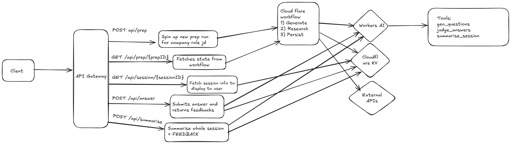

# Interview prep tool built on cloudflare

Tool that entirely runs entirely on Cloudflare's stack. It researches companies, generates tailored interview questions, evaluates answer and provides constructive feedback all persisted on Cloudflare KV.

## Overview

Users will be able to:

1) Start a prep session by entering a company and role.
2) Receive auto-generated questions (still deciding if we do technical + behavioural)
3) Submit answers and get tailored feedback based on company principles + values
4) View a session summary with key insights

## Basic Architecture 

